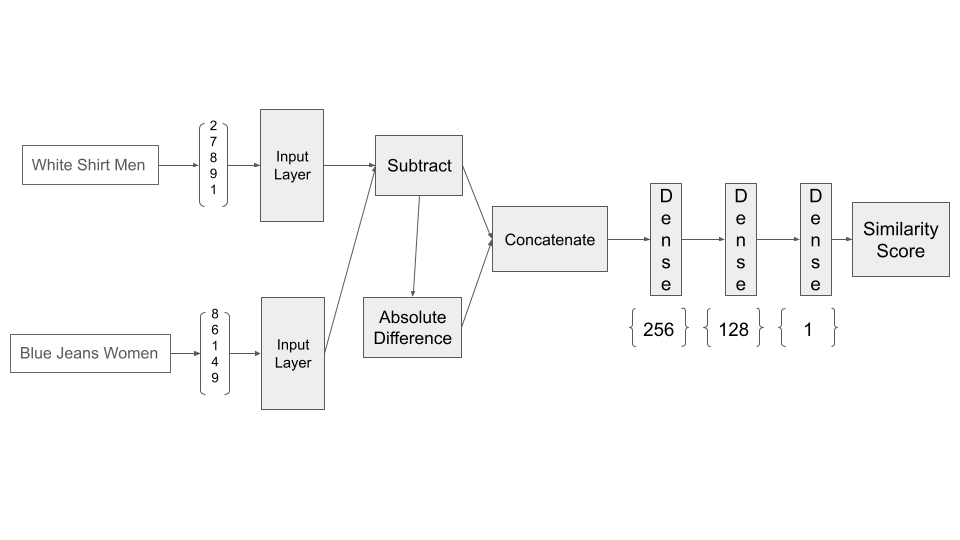
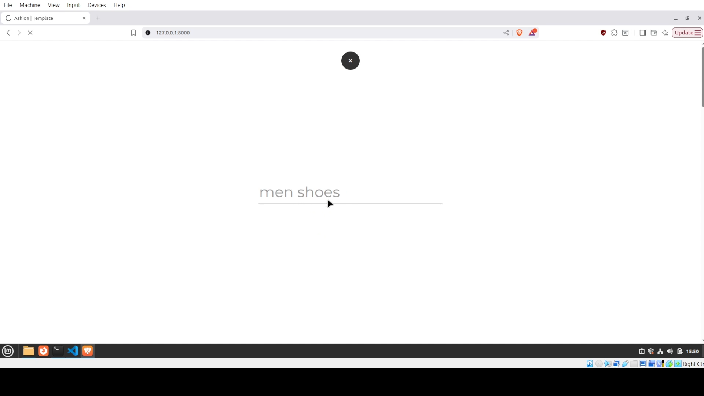
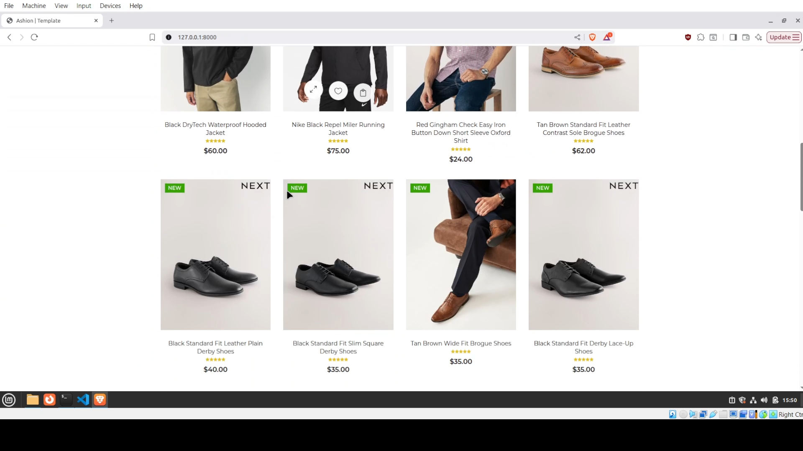

# The model training, web scraping scripts are available in the assets folder 

### This project was actually written 2 years ago. So, back then Lambda(Tensorflow) was used in the model architecture.Now, it has been depricated and I replaced it with AbsLayer. The free template Ashion was used alongside my custom django backend. The backend simply queries the model with the search queries and based on that the model generates a list of items that are going to be recommended.

# Model architecture

# Screenshots
## The recommendation is done based on search results

## Watch the video

